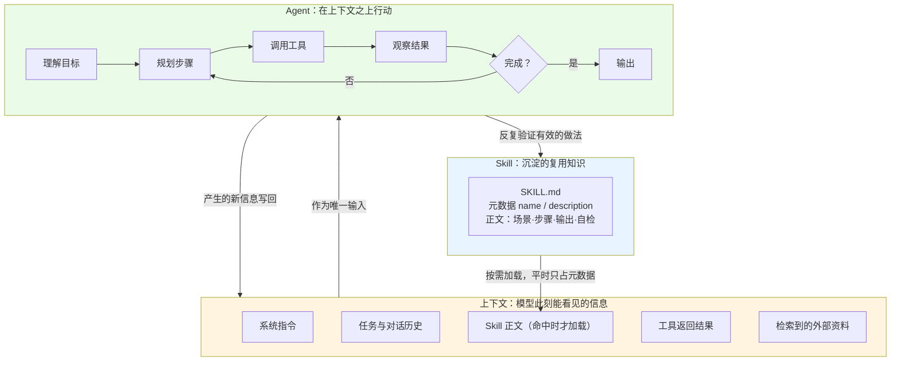

# 三个概念之间的关系：Agent、大模型的上下文、Skill

> 本文同时提供 HTML 版本 `concept-relationship.html`，内容一致，排版更适合浏览器阅读。
> 对应关系：作业目录结构中列出的是 `.html`，而"内容要求三"中写作 `.md`，故两者都提供。

---

## 一、先给结论

这三个概念不在同一层，把它们并列容易糊涂。我的理解是三种不同的"角色"：

| 概念 | 角色 | 一句话 |
|---|---|---|
| **上下文（Context）** | 载体 | 模型此刻能"看见"的全部信息，一切判断都只基于它 |
| **Agent（智能体）** | 执行者 | 在上下文之上做规划、调工具、多轮推进直到完成目标的程序 |
| **Skill（技能）** | 知识资产 | 把"这类任务该怎么做"固化下来，按需加载进上下文的指令包 |

所以它们的关系不是"A、B、C 三种技术"，而是：

> **Skill 写进上下文，上下文喂给 Agent，Agent 干活产生新信息，新信息又回到上下文——
> 而做得好的做法，最终会被沉淀成新的 Skill。**

这是一个闭环，不是一条直线。

---

## 二、关系图



**如果 Mermaid 无法正常渲染**，等价的文字版：

```
        ┌─────────────────────────────────────┐
        │  Skill（沉淀的复用知识）              │
        │  SKILL.md：元数据 + 正文指令          │
        └──────────────┬──────────────────────┘
                       │ ① 命中场景时按需加载正文
                       ▼
        ┌─────────────────────────────────────┐
        │  上下文（模型此刻能看见的一切）        │
        │  系统指令 / 历史 / Skill正文 / 工具结果 │
        └──────────────┬──────────────────────┘
                       │ ② 作为唯一输入
                       ▼
        ┌─────────────────────────────────────┐
        │  Agent（规划 → 调工具 → 观察 → 循环）  │
        └──────────────┬──────────────────────┘
                       │ ③ 新信息写回上下文
                       └──────► 回到「上下文」

        ④ 反复验证有效的做法 → 固化为新的 Skill → 回到最上层
```

---

## 三、上下文如何决定 Agent 的工作

这是三者关系里最关键的一环，也是我学之前最容易忽略的。

### 1. 上下文是 Agent 的"唯一现实"

Agent 看起来在"自主思考"，但它每一轮决策所能依据的信息，只有上下文窗口里那点内容。
上下文里没有的东西，对它而言就等于不存在。

所以：**Agent 的能力上限，不只取决于模型本身，还取决于你往上下文里放了什么。**
给同样的模型塞进不同的上下文，表现可以天差地别。

### 2. 窗口有限，长任务必然溢出

上下文窗口有容量上限（以 token 计）。Agent 跑一个长任务时，历史、工具返回、中间结果会不断累积，
迟早撑满。这时通常有几种处理：

- **压缩**：把早期的对话总结成一段摘要，用摘要替换原文
- **卸载**：把大段内容写进文件，上下文里只留路径和要点
- **检索**：不常驻，需要时再按相关度取回

这也解释了为什么"把资料全塞进去"不是好办法——塞得越多，成本和延迟越高，
而且中间部分反而更容易被忽略（即 Lost in the Middle 现象 [2]）。

### 3. 上下文质量比长度更重要

我的判断：**上下文工程的核心不是"塞满"，而是"让关键信息出现在模型真正会注意的位置"。**
实践中这意味着——重要约束放在开头或结尾、剔除无关内容、把长文档拆成按需取用的片段。

---

## 四、Skill 如何沉淀可复用的任务知识

### 1. 从"每次重说一遍"到"写一次，反复用"

没有 Skill 时，要让模型稳定地产出某种格式的内容，你得每次把要求重新描述一遍，
而且每次的描述还不一样，输出自然也不稳定。

Skill 做的事是把这套要求**固化成一个文件**：

- **元数据（name / description）**：常驻，让模型知道"有这么个技能、什么时候该用"
- **正文（适用场景、输入、步骤、输出结构、自检）**：命中场景时才加载进上下文

### 2. 按需加载本身就是一种上下文优化

这点是我学完三个概念才串起来的：**Skill 的分层加载，本质是在省上下文。**

如果每个 Skill 的正文都常驻上下文，装十个 Skill 就把窗口撑爆了。
分层之后，平时只占几十个 token 的元数据，真正命中了才把完整正文拉进来——
**用上下文的"按需分配"，换来了可挂载能力的"几乎无限"。**

这也正是 Skill 和"一段长提示词"的根本区别：提示词是每次都要占用上下文的常量，
Skill 是按需取用的可寻址资源。

### 3. Skill 是 Agent 的能力扩展槽

Agent 负责"怎么推进任务"，Skill 负责"这类任务该怎么做"。
Agent 在循环中选择用哪个 Skill，就像技工在工序中选择用哪把工具。
Skill 越多、写得越好，同一个 Agent 能稳定胜任的任务类型就越多。

---

## 五、我自己的判断（不是资料里的原话）

学完这三个概念，我改变的一个看法是：

**我原本以为 Agent 强不强主要取决于模型，现在觉得"喂给它的上下文质量"至少是一半。**
同样是写一个数据分析脚本，有没有把项目的目录约定、命名规范、已有工具函数放进上下文，
结果差别很大。模型没变，变的是上下文。

另一个体会是 **Skill 的价值不在"省事"，而在"稳定"**。
它的真正意义是把一次偶然的好结果，变成可以重复的好结果。
这点对做作业也一样：与其每次重新描述要求，不如写清标准，之后每次都按它来。

还有一个我目前没想透的问题，也记在这里：
**Skill 和"上下文里的系统提示"到底该怎么分工？** 两者都在指导模型行为，
我现在的理解是——长期不变、跨任务通用的放系统提示；
针对某类任务、需要按需加载的放 Skill。但这个划分是否站得住，还需要更多实践检验。

---

## 六、资料来源

| # | 来源 | 链接 | 核验状态 | 支撑内容 |
|---|---|---|---|---|
| [1] | Anthropic《Building effective agents》 | https://www.anthropic.com/engineering/building-effective-agents | 已核验 200 | Agent 的基本结构、工作流分类 |
| [2] | Liu et al.《Lost in the Middle》 | https://arxiv.org/abs/2307.03172 | 已核验 200 | 长上下文中段信息易被忽略 |
| [3] | Anthropic《Effective context engineering for AI agents》 | https://www.anthropic.com/engineering/effective-context-engineering-for-ai-agents | 已核验 200 | 上下文工程、按需加载策略 |
| [4] | Anthropic《Equipping agents for the real world with Agent Skills》 | https://www.anthropic.com/engineering/equipping-agents-for-the-real-world-with-agent-skills | 已核验 200 | Skill 的分层加载与定位 |
| [5] | Anthropic 官方 Skills 发布公告 | https://www.anthropic.com/news/skills | 已核验 200（跳转至 claude.com/blog/skills） | Skill 的产品定位 |

**未核验说明**：`docs.claude.com` 与 `docs.anthropic.com` 域下的文档页在本机被重定向至
`claude.com/app-unavailable-in-region`（地区限制），虽然返回 200 但读不到正文，
因此本文**未引用**其任何内容，也未采信其中可能存在的字段说明。
